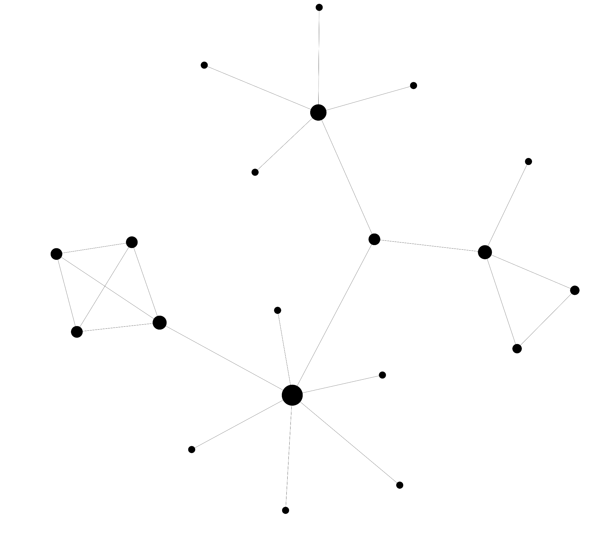
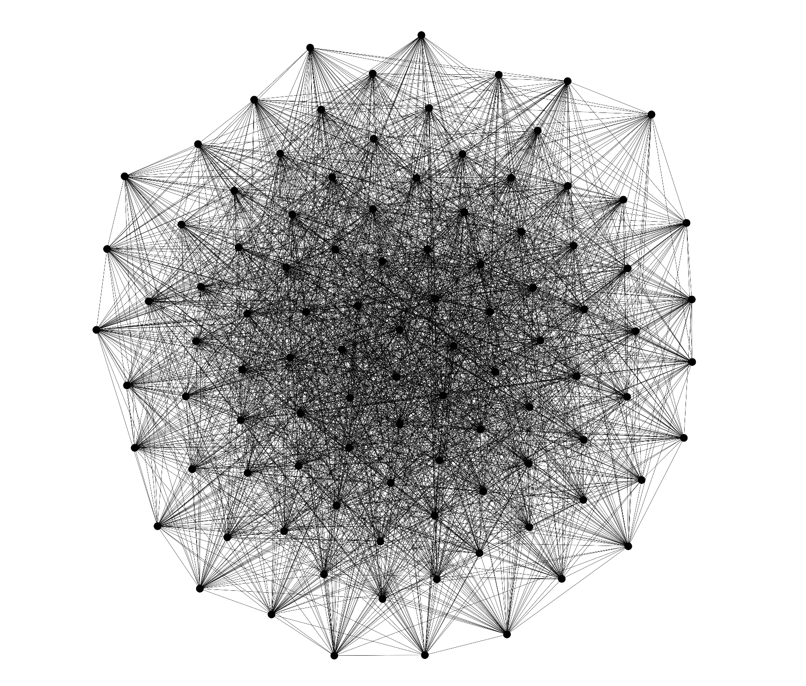

# Force graph using numerical optimization
This repo is a personal project that aims to create a [force graph](https://en.wikipedia.org/wiki/Force-directed_graph_drawing) using numerical optimization.

The project is entirely created by myself, therefore there are probably better loss to use, in case, open an issue and i'll be glad to discuss about that.

## Introduction
This project aims to create a force graph minimizing a loss function that should describe a configuration.

In order to converge to a more "stable" configuration, numerical optimization is being used. In particular are being implemented 2 different algorithms:

 - Gradient descent
 - Nesterov Accelerated Gradient

## Implementation
There are some script file with different versions:
 
 - `other-versions/script.js`: a naive implementation using GD, the main feature is that the image is scaled in the display 
 - `other-versions/script-drag.js`: implementation with GD but you can drag the vertexes around (and has a loss graph)
 - `other-versions/script-drag-momentum.js`: implementation with NAG and as for the previous you can drag the vertexes around (and has a loss graph)
 - `other-versions/script-drag-momentum-manual.js`: implementation as the previous, but has an array called `pairs` where can be manually specified the connections  
 - `script-drag-momentum-manual-oop.js`: same as the previous, but the code is being reviewed to be more OOP/readable, and the HTML file has some user interface

## Loss/objective function
In order to create a force map, a configuration is evaluated on the following loss:
<!-- f(\bar{p}) = \sum_{i=0}^{|p|}\sum_{j=0}^{|p|} a_{ij} ||p_{i} - p_j||^2 + \sum_{i=0}^{|p|}\sum_{j=0}^{|p|} (1-a_{ij}) e^{-||p_{i} - p_j||^2} -->
&space;=&space;\sum_{i=0}^{|p|}\sum_{j=0}^{|p|}&space;a_{ij}&space;||p_{i}&space;-&space;p_j||^2&space;&plus;&space;\sum_{i=0}^{|p|}\sum_{j=0}^{|p|}&space;(1-a_{ij})&space;\frac{1}{||p_{i}&space;-&space;p_j||^2}&plus;&space;\sum_{i=0}^{|p|}\sum_{j=0}^{|p|}&space;&space;\frac{1}{||p_{i}&space;-&space;p_j||^2})

With the following definitions:
 -   is a vector of 2D points (positions of the vertexes)
  -   is a NxN matrix where  that specifies if two points are connected (must be symmetric for obvious reasons)

The first part of the objective aims to drag points that are connected with each other, the second term aims to move aways points that are not connected, the third part is used to keep every point far from each other, otherwise complete graphs () will collapse to a single point, 0.

Other losses are being tested, for example having  as second term. However, seems that it's necessary to have a function that goes to infinity as the distance gets to zero for not connected points, otherwise the modes will just stretch to infinity some points

In the actual calculated gradient, is also being added a Gaussian prior  on the positions, in order to keep the graph near 0

## How to use
A demo can be seen [here](https://htmlpreview.github.io/?https://github.com/AlbertoSinigaglia/force-graph/blob/main/force-graph-optimization.html), otherwise it's enough to clone/download the repo and open the HTML file

## Results:
Following images are results of the uploaded code:
Manual graph             |  Random graph
:-------------------------:|:-------------------------:
  |  

## Licence
Do whatever you want

## Others
Pay attention that for some reason that I'm not fully interested, it works fien only if the width of the display is greater than the height (in other words, turn your phone or tablet horizontally)